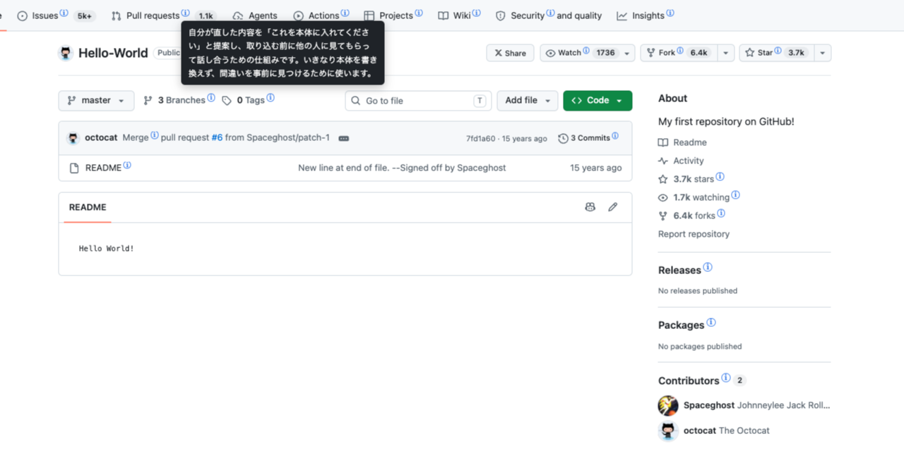

# RepoGloss

GitHub のページで、Git / GitHub 固有の英単語の右に小さな ⓘ を付ける Chrome 拡張です。ⓘ にカーソルを乗せると日本語の説明が出ます。英語表示はそのまま残ります。

---

## 画面

`Pull requests` `Issues` `Actions` `Projects` `Wiki` のように、辞書にある語の右へ小さな ⓘ が付きます。ⓘ にカーソルを乗せると、その語の説明が吹き出しで出ます（画像は `pull request` の説明）。

## 動作

- 対象は `github.com` のみ
- 辞書に登録された **61 語**に印が付く。**同じ語はページで最初の1回だけ**
- コード表示部分（`<pre>` `<code>` および GitHub のコードビューア）には印を付けない
- 画面右下のボタンで ON / OFF を切り替え（設定は保存される）

英語を日本語に置き換える機能はありません。

## 権限とデータの扱い

| | |
|---|---|
| 要求する権限 | `storage` のみ |
| 読み取るもの | `github.com` のページに表示されている文章 |
| その用途 | 同梱辞書との照合。端末内で完結し、保存しない |
| 外部通信 | なし |
| 保存するもの | ON / OFF の設定（真偽値ひとつ） |

`host_permissions` `tabs` `activeTab` `scripting` は要求しません。詳細は [PRIVACY.md](./PRIVACY.md)。

`github.com` のページ本文を区別なく走査するため、private リポジトリの画面でも動作します。内容は端末の外へ出ませんが、気になる画面では右下のボタンで OFF にしてください。

## インストール

**[Chrome ウェブストアで公開しています](https://chromewebstore.google.com/detail/ihkkhkleamggokepaelapoiabgmpljnn)**（2026-08-03 公開・v1.7.1）。

ソースから手動で読み込む場合

1. このリポジトリを clone するか、ZIP でダウンロードして展開する
2. Chrome で `chrome://extensions/` を開き、右上の **デベロッパー モード** を ON にする
3. **「パッケージ化されていない拡張機能を読み込む」** から展開したフォルダを選ぶ
4. `github.com` を再読み込みする

## 完成度

個人が開発している非公式ツールです。基本的な動作は実機で確認していますが、**継続的な使用による検証は経ていません。** 導入を判断する材料として、現時点の状況を書きます。

**確認できているもの**

- 実際の `github.com` 上での動作 — 印の表示、ツールチップの表示、コード領域を避けること（2026-08-03 実機で確認）
- 画面遷移をまたいだときの動作 — GitHub はページを読み直さずに中身を差し替えるため、印の付け漏れと重複が起きていました。実機で印の数を数えながら v1.7.1 で修正しています（同日）
- 用語の判定（どの語に印を付けるか）— 13 ケースの自動テスト
- 構成の整合（参照ファイル・JSON・構文・CSS クラス名）

**確認できていないもの**

- 大きなページでの速度への影響
- Windows / Linux での表示
- 説明文が実際の初学者にとって分かりやすいか

継続的な保守を約束できる体制ではありません。ただし辞書は概念語に絞ってあるため、更新が止まっても内容が古くなりにくい作りにしています（[DESIGN.md](./DESIGN.md)）。

不具合・誤訳・追加してほしい語は Issue でお知らせください。

## 収録している語

61 語。Git / GitHub 固有の概念語に限っています。画面のラベル（`view all` など）や一般的な英単語（`on` `open` `code` など）は含みません。

`reset` `revert` `token` `ssh key` `force push` など取り返しのつかない操作については、何を失うかを説明に含めています。たとえば `reset` と `revert` は、前者では記録に残していない編集が消えること、後者では前の記録が消えないことを、それぞれ明記しています。

辞書の実体は [`locales/dict.json`](./locales/dict.json) です。追加・修正の方法と、語の選び方は [DESIGN.md](./DESIGN.md) にあります。

## ライセンス

MIT License（[LICENSE](./LICENSE)）

## 免責

本拡張は GitHub, Inc. とは無関係で、同社による承認・後援を受けていません。GitHub は GitHub, Inc. の商標です。

This extension is not affiliated with, endorsed by, or sponsored by GitHub, Inc. GitHub is a trademark of GitHub, Inc.

## 変更履歴

| Version | 内容 |
|---|---|
| 1.7.1 | 「同じ語は最初の1回だけ」の実装の不具合を2件修正。①画面を読み直さずに移動したとき、前の画面で印を付けた語が飛ばされていた ②GitHub が画面の一部を描き直して印ごと消えると、その語に二度と印が付かなかった |
| 1.7.0 | 同じ語はページで最初の1回だけ印を付けるようにした。git の解説ページのように用語が繰り返される文書で印が数百個になり、本文が読めなくなっていたため（実測 843 → 43 個）。印に使っていた文字が macOS のフォントに無く Mac では表示されていなかった問題を修正（文字に依存しない描画へ変更）。ツールチップを標準の `title` から自前描画へ変え、待ちなく出るようにした |
| 1.6.0 | 辞書を概念語 61 語へ絞り、説明文を全面的に書き直し。用語判定の不具合を修正（1 要素につき 1 個しか印が付かない／キーの優先順／単複の揺れ／コード領域の除外）。設定の保存先を `chrome.storage.local` へ変更。`RepoGloss` へ改名 |
| 1.5.0 | 辞書 151 語。ON/OFF ボタン、ダークモード対応 |
| 1.1 | 初期版（辞書 45 語） |
